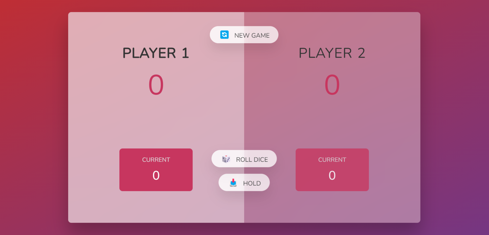

# Pig Game

Welcome to the Pig Game! This is a simple web-based game that you can play with two players. The goal is to reach a predefined score by rolling a dice and accumulating points. Be careful not to roll a 1, as that will reset your current score!

## Game Rules

The Pig Game has a few simple rules:

1. Two players take turns to roll a dice.
2. The current player's score is accumulated as long as they continue to roll numbers other than 1.
3. If a player rolls a 1, their current score resets to 0, and it becomes the other player's turn.
4. Players can choose to "Hold," which adds their current score to their total score and switches to the other player.
5. The first player to reach the predefined score wins the game.

## How to Play

1. Open the Pig Game in your web browser.
2. Click the "New Game" button to start a new game.
3. Roll the dice by clicking the "Roll Dice" button.
4. Try to accumulate as many points as possible without rolling a 1.
5. Click the "Hold" button to add your current score to your total score and switch to the other player.
6. Continue taking turns and try to reach the winning score to win the game.

## Screenshots

## Technologies used
- Html
- Css
- Javascipt
